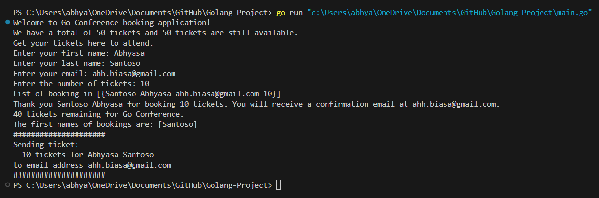

# Golang-Project

### Go Ticket Booking Application

This Go project, designed as a ticket booking application for a conference, includes main functionality to register users for tickets, validate user input, manage booking records, and send confirmation tickets asynchronously. Here’s a breakdown of the main components:

#### Files and Structure

1. **main.go**: Contains the core logic for booking tickets, validating input, handling bookings, and printing user information.
2. **helper.go**: Provides validation functions for user input, ensuring that names, emails, and ticket numbers meet required standards.
3. **go.mod**: Manages module dependencies and sets the Go version for the project.

#### Key Components and Functions

- **Global Variables and Constants**:
   - `conferenceName`, `conferenceTickets`, and `remainingTickets` manage the conference details and ticket count.
   - `bookings`: a slice of `UserData` structs stores individual booking details.

- **UserData Struct**: Defines the structure for storing user details, including `firstName`, `lastName`, `email`, and `numberOfTickets`.

- **greetUsers()**: Displays a welcome message and current ticket availability.

- **getUserInput()**: Prompts the user for details and captures their input.

- **ValidateUserInput()**: Ensures the user's first and last names have at least two characters, the email contains an `@` symbol, and the requested ticket count is within available limits.

- **bookTicket()**: Adds a valid booking to `bookings`, reduces `remainingTickets`, and confirms the booking to the user.

- **sendTicket()**: Uses goroutines to simulate email ticket sending with a delay, utilizing `sync.WaitGroup` to synchronize and ensure all tickets are sent before the program terminates.

- **Concurrency with Goroutines**: The `sendTicket` function is called in a separate goroutine to avoid blocking the main process. The `sync.WaitGroup` ensures that the program waits for all ticket emails to be sent before exiting.

#### Usage Example

The user runs the application, providing their name, email, and ticket quantity. If the input is valid, a ticket is booked, added to the `bookings` list, and an email simulation is triggered. In case of invalid input, specific error messages are displayed to guide the user.

#### Terminal Example

